# Assignment 3 HLD — Drone Mapper Simulator (plugin-based, multithreaded)

> **Status:** design document for an unimplemented skeleton. `common/`,
> `Simulator/common_simulator/`, and `MissionControl/common_mission_control/` are provided and frozen;
> everything else described here is to be written. Where this document states that a class "does" something,
> read it as "is specified to do".
>
> **Baseline:** `project_context.md` (repo root) is the requirements source of truth. This document is the
> *architecture* that satisfies it. Where the two disagree, `project_context.md` wins and this file gets fixed.
>
> **Reference:** `ex2/docs/HLD.md` describes the Assignment 2 design that this one evolves from. Section 2
> below is the delta.

---

## Table of contents

1. [Scope and design goals](#1-scope-and-design-goals)
2. [What changed from Assignment 2, and why](#2-what-changed-from-assignment-2-and-why)
3. [Project boundaries and the plugin contract](#3-project-boundaries-and-the-plugin-contract)
4. [The central architectural problem](#4-the-central-architectural-problem)
5. [Component catalogue](#5-component-catalogue)
6. [Class diagrams](#6-class-diagrams)
7. [Sequence diagrams](#7-sequence-diagrams)
8. [Concurrency design](#8-concurrency-design)
9. [Ownership, lifetime, and teardown](#9-ownership-lifetime-and-teardown)
10. [Error containment](#10-error-containment)
11. [Design decisions and rationale](#11-design-decisions-and-rationale)
12. [Open decisions](#12-open-decisions)
13. [Constraint traceability](#13-constraint-traceability)

---

## 1. Scope and design goals

The system flies a simulated drone through a hidden 3D voxel map, scanning with a simulated lidar, and
builds an occupancy map as the mission runs. Assignment 3 turns that single program into a **plugin host**:
the mission-driving logic and the mapping algorithm each become a separately built `.so`, so any team's
simulator can run any team's plugins, in many combinations, concurrently.

Design goals, in priority order — later goals are sacrificed to earlier ones where they conflict:

| # | Goal | Consequence in the design |
|---|---|---|
| 1 | **Never crash, never `exit()`** | Failure is contained at the narrowest scope that still makes sense; `main` has exactly one exit path per branch |
| 2 | **Frozen interfaces stay frozen** | Every Ex3-specific concept lives in new Simulator-side classes *wrapped around* the provided interfaces |
| 3 | **Plugin isolation** | A plugin can never reach ground truth, and can never observe another plugin |
| 4 | **Deterministic output** | The same composition produces byte-identical reports at any thread count |
| 5 | **Lock-free where the data allows** | Shared mutable state is reduced to exactly two things (the error log and `std::cout`) |
| 6 | **Port understanding, not code** | Ex2's geometry and loop logic is reused as knowledge; every file is written fresh |

Goal 4 deserves emphasis because it is not merely nice-to-have: comparative mode groups mission controls by
**behavioural equality**. If thread scheduling could perturb a result or reorder a report, the grouping
would be nondeterministic and the mode meaningless.

---

## 2. What changed from Assignment 2, and why

Assignment 2 was one executable containing one statically linked MissionControl and one statically linked
MappingAlgorithm, running a Cartesian product of configurations serially.

| Dimension | Ex2 | Ex3 | Why it changed |
|---|---|---|---|
| Binaries | 1 executable + 1 static lib (+ a comparison tool) | 1 executable + 2 `.so` | Plugins must be swappable across teams without recompiling the host |
| Loop dimensions | 4 (sim × mission × drone × lidar) | 5 (+ plugin) | Both modes vary a plugin folder |
| Execution | serial | thread pool over a dense task table | Explicit assignment requirement; also the only way the 5-dimensional product finishes in reasonable time |
| `DroneControl` | Simulator-side, built by the run factory | inside `MissionControl_*.so` | `MissionControlDependencies` carries raw sensors and states *"mission will create its own drone controller"*. Drone stepping is mission **policy**, not simulator infrastructure |
| Hidden map → MissionControl | passed by reference | **not passed** | A third-party plugin must not be able to read ground truth. Scoring is the simulator's job |
| `ScanResultToVoxels` | course-provided in `common` | absent — ours, in `MissionControl/` | It follows drone stepping across the `.so` boundary |
| Reports | one `simulation_output.yaml` | one per plugin **plus** a mode-level report | Comparing/ranking plugins is the new deliverable |
| Teardown | implicit, destructor order | explicit 4-step sequence | `dlclose` must not run while plugin-owned objects live |
| Entry point | 2 positional arguments | mode flag + order-free `key=value` with collecting error reporting | Assignment §3.1 |

**What did not change, and this is most of the system:** the drone model, the angle convention
(`0° = +X east`, `90° = +Y south`), the lidar beam geometry, the voxel occupancy states, the `.npy` map
format, the YAML composition layout, the mission step loop and its two ordering rules, and the
occupied-voxel IoU scoring. The PDF is explicit that *"interfaces are not changed from assignment 2"*.

The honest one-sentence summary: **Ex3 is Ex2's pipeline with two new layers stacked on top (plugin
lifecycle, concurrent scheduling) and one internal boundary moved (drone control crosses into the
MissionControl plugin).**

---

## 3. Project boundaries and the plugin contract

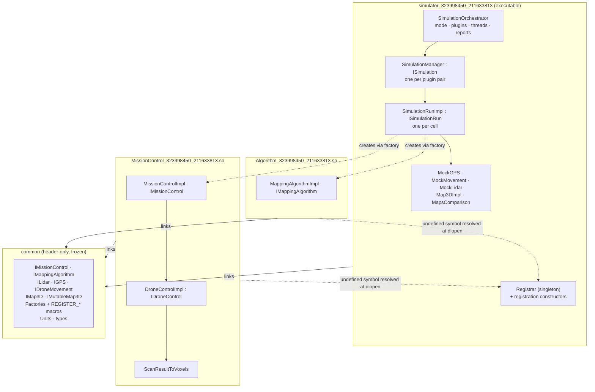

### 3.1 Why the folders split this way

The rule is **audience**, not convenience:

- `common/` — interfaces used by **more than one project**. Frozen, course-provided, never extended.
- `MissionControl/common_mission_control/` — `IDroneControl`, used *within* the MissionControl subsystem only.
  It is not in `common/` precisely because no one outside that `.so` may depend on how a mission drives its drone.
- `Simulator/common_simulator/` — `ISimulation`, `ISimulationRun`, `ISimulationRunFactory`, `SimulationTypes`.
  Simulator-internal composition machinery; a plugin has no business knowing a "simulation run" exists.
- `UserCommon/` — **our** code needed by more than one project. Does not exist yet; see §12.
- The **mocks live in `Simulator/src/`** deliberately. `MockGPS`, `MockMovement`, `MockLidar`, `Map3DImpl` are
  simulation *fictions*. A real deployment replaces them with drivers while the plugins stay untouched — which
  is exactly the point of the `ILidar`/`IGPS`/`IDroneMovement` abstractions. They are also the only objects in
  the system that touch the hidden map.

### 3.2 The plugin contract, exactly

A plugin is a shared library that, at load time, calls back into the host **once**. That is the entire contract:

```cpp
// Algorithm/src/MappingAlgorithmRegistrationEntry.cpp
using MappingAlgorithmImpl_323998450_211633813 = algorithm::MappingAlgorithmImpl;
REGISTER_MAPPING_ALGORITHM(MappingAlgorithmImpl_323998450_211633813);
```

The macro expands to a **global object with static storage duration** whose constructor takes a
`std::function` factory. The constructor is *declared* in `common/` but **defined in the Simulator**, so the
plugin ships with an undefined symbol resolved against the executable at `dlopen` time. Three consequences
that shape the build and the design:

1. The executable must export its dynamic symbols (`ENABLE_EXPORTS ON` / `-rdynamic`). Omitting it produces a
   **runtime** `dlopen` failure, never a build error.
2. The receiving side must be reachable from a free function with no context parameter — the frozen
   constructor signature takes only the factory. That **forces** a singleton `Registrar`; it is not a
   stylistic choice.
3. The macro token-pastes its argument into `register_me_##class_name`, so a qualified name cannot be passed.
   A global-scope alias carrying the ID suffix solves both that and symbol uniqueness.

---

## 4. The central architectural problem

The provided simulator interfaces have **no plugin dimension**:

```cpp
// ISimulation.h
types::SimulationManagerReport run(const types::SimulationCompositionData& composition,
                                   const std::filesystem::path& output_path);

// ISimulationRunFactory.h
std::unique_ptr<ISimulationRun> create(const types::SimulationConfigData&,
                                       const common::types::MissionConfigData&,
                                       const common::types::DroneConfigData&,
                                       const common::types::LidarConfigData&,
                                       const std::filesystem::path& output_path);
```

Neither mentions a mode, a MissionControl, or an Algorithm — and neither may be changed. Three ways to close
the gap were considered:

| Option | Verdict |
|---|---|
| Add a plugin parameter to `create()` | **Rejected** — changes a frozen signature |
| A global "currently selected plugin" the factory reads | **Rejected** — unusable under concurrency, and invisible coupling |
| **Bind the factory instance to a plugin pair at construction** | **Chosen** |

> **Decision.** A `SimulationRunFactoryImpl` instance is **bound at construction to exactly one
> `(MissionControlFactory, MappingAlgorithmFactory)` pair**. One `ISimulation::run(...)` call therefore
> covers the whole composition for exactly one plugin pair and returns one `SimulationManagerReport`.
> A new orchestration layer *above* `ISimulation` owns the plugin registry, the mode, the thread pool,
> and the aggregation of N reports into the mode-level YAML.

The constructor is ours to define, so this costs nothing in interface compliance. It also has a property the
other options lack: **each `ISimulation::run` becomes a pure function of `(composition, plugin pair)` with no
shared mutable state**, which is precisely what makes the concurrency safe by construction rather than by
locking.

---

## 5. Component catalogue

### Simulator (`Simulator/include/Simulator/`, `Simulator/src/`)

| Class | Responsibility | Notes |
|---|---|---|
| `CommandLineArgs` | Order-independent `key=value` parsing, mode selection, **collecting** error reporting, file/folder validation | Never throws to the caller; exposes `ok()` + `usage()` + `errors()` |
| `ErrorLogger` | Immediate, mutex-guarded logging to `errors.log`; lazy `input_errors.txt` | The only always-shared mutable object besides `std::cout` |
| `PluginLibrary` | RAII over one `dlopen` handle | `dlclose` **only** in the destructor; move-only; non-copyable |
| `PluginLoader` | Enumerates a folder or takes one path; loads every `.so` **serially on the main thread**; claims each newly registered factory | Produces `LoadedAlgorithm` / `LoadedMissionControl` records pairing a filename with a factory |
| `Registrar` | Singleton receiving factories from the frozen registration constructors | Also owns `clear()`, called explicitly during teardown |
| `CompositionLoader` | YAML → `simulator::types::SimulationCompositionData` (+ `CompositionPaths`) | Ported from Ex2, file-reference layout only |
| `SimulationRunFactoryImpl` | `ISimulationRunFactory`; **bound to one plugin pair**; wires one run | Also derives the deterministic output-map filename |
| `SimulationRunImpl` | `ISimulationRun`; owns one run's whole object graph; runs the mission and scores it | |
| `SimulationManager` | `ISimulation`; enumerates cells for one plugin pair, delegates execution, assembles the report | |
| `SimulationTaskTable` | The dense, pre-computed cell vector across **all** plugin pairs, plus the parallel results vector | Cells are disjoint; no mutex |
| `ITaskExecutor` / `InlineExecutor` / `ThreadPoolExecutor` | Execution strategy honouring the `num_threads` rule | Atomic-cursor work distribution |
| `SimulationOrchestrator` | Owns mode, plugin set, task table, executor, and report writers | The layer above `ISimulation` |
| `MapsComparison` | Occupied-voxel IoU, 0–100 | Simulator-internal; no standalone executable in Ex3 |
| `Map3DImpl` | `IMap3D` + `IMutableMap3D` over a tinynpy array | |
| `MockGPS` / `MockMovement` / `MockLidar` | Simulated pose, actuation, and ray-marched sensing | Only `MockLidar` sees the hidden map |
| `SimulationOutputWriter` | Per-plugin `score_report:` YAML | Ported from Ex2 |
| `ComparativeReportWriter` | Behavioural-equivalence grouping + `comparative_report:` YAML | New |
| `CompetitiveReportWriter` | Score/steps ranking + `competitive_report:` YAML | New |

### MissionControl plugin (`MissionControl/`)

| Class | Responsibility |
|---|---|
| `MissionControlImpl` | `IMissionControl`; builds its own `DroneControlImpl`, drives the step loop, saves the output map, emits verbose files if asked |
| `DroneControlImpl` | `IDroneControl`; movement validation, the movement-before-scan ordering, scan application |
| `ScanResultToVoxels` | Beam distances → voxel writes, with evidence-priority merging |

### Algorithm plugin (`Algorithm/`)

| Class | Responsibility |
|---|---|
| `MappingAlgorithmImpl` | `IMappingAlgorithm`; deterministic frontier-BFS exploration planned purely off the read-only output map |

---

## 6. Class diagrams

### 6.1 The contract layer and the plugins

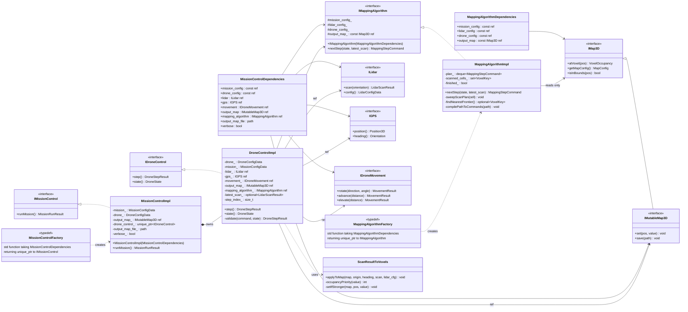

Two things this diagram is designed to make visible:

- **`MissionControlImpl` owns `DroneControlImpl` by composition** (filled diamond). Nothing outside the
  `.so` can see or construct it.
- **`MappingAlgorithmImpl` has an `IMap3D&`, not an `IMutableMap3D&`.** The type system enforces that the
  algorithm can read the map but cannot write it. Writes flow only through `DroneControlImpl` →
  `ScanResultToVoxels`.

### 6.2 Simulator internals

```mermaid
classDiagram
    direction TB

    class ISimulation {
        <<interface>>
        +run(composition, output_path) SimulationManagerReport
    }

    class ISimulationRun {
        <<interface>>
        +run() SimulationResult
    }

    class ISimulationRunFactory {
        <<interface>>
        +create(sim, mission, drone, lidar, output_path) unique_ptr~ISimulationRun~
    }

    class ITaskExecutor {
        <<interface>>
        +forEach(count, body) void
    }

    class InlineExecutor {
        +forEach(count, body) void
    }

    class ThreadPoolExecutor {
        -worker_count_ : size_t
        -cursor_ : atomic~size_t~
        +ThreadPoolExecutor(requested_threads, task_count)
        +forEach(count, body) void
    }

    class SimulationOrchestrator {
        -args_ : CommandLineArgs ref
        -composition_ : SimulationCompositionData ref
        -composition_paths_ : CompositionPaths ref
        -identity_ : ConfigIdentityIndex ref
        -results_directory_ : path
        -logger_ : ErrorLogger ref
        -executor_ : ITaskExecutor ref
        -plugins_ : vector~PluginRun~
        +SimulationOrchestrator(args, composition, paths, identity, results_dir, logger, executor)
        +execute(load_report) void
        -buildManagers(load_report) void
    }

    class PluginRun {
        +manager : unique_ptr~SimulationManager~
        +report_name : string
    }

    class SimulationManager {
        -run_factory_ : unique_ptr~ISimulationRunFactory~
        -plugin_name_ : string
        -logger_ : ErrorLogger ref
        +SimulationManager(run_factory, plugin_name, logger)
        +run(composition, output_path) SimulationManagerReport
        +enumerate(composition, output_path, table) void
        +runCell(table, index) void
        +assemble(composition, results_slice) SimulationManagerReport
        +pluginLabel() string ref
    }

    class SimulationTaskTable {
        -cells_ : vector~RunCell~
        -results_ : vector~SimulationResult~
        -plugin_ranges_ : vector~pair~size_t,size_t~~
        +append(cell) void
        +closePluginRange(begin) void
        +seal() void
        +size() size_t
        +cell(i) RunCell ref
        +result(i) SimulationResult ref
        +pluginCount() size_t
        +resultsForPlugin(plugin_index) vector~SimulationResult~
    }

    class RunCell {
        +factory : ptr to ISimulationRunFactory
        +simulation : ptr to SimulationConfigData
        +mission : ptr to MissionConfigData
        +drone : ptr to DroneConfigData
        +lidar : ptr to LidarConfigData
        +output_path : path
        +plugin_index : size_t
    }

    class SimulationRunFactoryImpl {
        -mission_control_factory_ : MissionControlFactory
        -algorithm_factory_ : MappingAlgorithmFactory
        -plugin_label_ : string
        -identity_ : ConfigIdentityIndex
        -verbose_ : bool
        +SimulationRunFactoryImpl(mc_factory, algo_factory, label, identity, verbose)
        +create(sim, mission, drone, lidar, output_path) unique_ptr~ISimulationRun~
        -outputMapFile(output_path, sim, mission, drone, lidar) path
        -resolveOutputResolution(gps_res, map_res, factor) pair
    }

    class SimulationRunImpl {
        -hidden_map_ : unique_ptr~const IMap3D~
        -output_map_ : unique_ptr~IMutableMap3D~
        -gps_ : unique_ptr~IGPS~
        -movement_ : unique_ptr~IDroneMovement~
        -lidar_ : unique_ptr~ILidar~
        -mapping_algorithm_ : unique_ptr~IMappingAlgorithm~
        -mission_control_ : unique_ptr~IMissionControl~
        -simulation_config_ : SimulationConfigData
        -mission_config_ : MissionConfigData
        -resolution_status_ : ResolutionRequestStatus
        -output_map_file_ : path
        +run() SimulationResult
    }

    class PluginLibrary {
        -handle_ : void ptr
        -file_ : path
        +PluginLibrary(path)
        +~PluginLibrary()
        +valid() bool
        +error() string
    }

    class PluginLoader {
        -libraries_ : vector~PluginLibrary~
        +loadAlgorithms(folder_or_file) vector~LoadedAlgorithm~
        +loadMissionControls(folder_or_file) vector~LoadedMissionControl~
        +releaseAll() void
    }

    class Registrar {
        -algorithm_factories_ : vector~MappingAlgorithmFactory~
        -mission_control_factories_ : vector~MissionControlFactory~
        +instance() Registrar ref
        +addAlgorithm(factory) void
        +addMissionControl(factory) void
        +takeLastAlgorithm() optional
        +takeLastMissionControl() optional
        +clear() void
    }

    class CommandLineArgs {
        +mode : RunMode
        +composition_file : path
        +mission_control_arg : path
        +algorithm_arg : path
        +num_threads : size_t
        +verbose : bool
        +parse(argc, argv) CommandLineArgs
        +ok() bool
        +errors() vector~string~
        +usage() string
    }

    class ErrorLogger {
        -mutex_ : mutex
        -file_ : ofstream
        +log(code, message) void
        +logInputError(code, message) void
    }

    class Map3DImpl {
        -array_ : unique_ptr~NpyArray~
        -config_ : MapConfig
        +atVoxel(pos) VoxelOccupancy
        +isInBounds(pos) bool
        +set(pos, value) void
        +save(path) void
        +loadArray(path) unique_ptr~NpyArray~
        +makeEmptyArray(config) unique_ptr~NpyArray~
    }

    class MockLidar {
        -config_ : LidarConfigData
        -hidden_map_ : const IMap3D ref
        -gps_ : const IGPS ref
        +scan(orientation) LidarScanResult
        -traceBeam(orientation) PhysicalLength
    }

    class MapsComparison {
        +compare(origin, targets) vector~double~
    }

    class ComparativeReportWriter {
        +write(reports, out_dir, meta) void
        -equalityKey(report) string
        -group(reports) vector~Group~
    }

    class CompetitiveReportWriter {
        +write(reports, out_dir, meta) void
        -totals(report) pair
    }

    ISimulation <|.. SimulationManager
    ISimulationRun <|.. SimulationRunImpl
    ISimulationRunFactory <|.. SimulationRunFactoryImpl
    ITaskExecutor <|.. InlineExecutor
    ITaskExecutor <|.. ThreadPoolExecutor

    SimulationOrchestrator *-- PluginRun : owns many
    PluginRun --> SimulationManager : owns
    SimulationOrchestrator ..> SimulationTaskTable : builds, local to execute()
    SimulationOrchestrator --> ITaskExecutor : uses, injected
    SimulationOrchestrator --> ComparativeReportWriter
    SimulationOrchestrator --> CompetitiveReportWriter
    SimulationTaskTable *-- RunCell
    RunCell --> ISimulationRunFactory : non-owning
    SimulationManager --> ISimulationRunFactory : owns
    SimulationRunFactoryImpl ..> SimulationRunImpl : creates
    SimulationRunImpl ..> MapsComparison : uses
    SimulationRunImpl --> Map3DImpl : owns two
    SimulationRunImpl --> MockLidar : owns
    PluginLoader *-- PluginLibrary
    PluginLoader ..> Registrar : claims from
    SimulationRunFactoryImpl ..> MockLidar : constructs
```

---

## 7. Sequence diagrams

### 7.1 Program lifecycle (the whole picture)

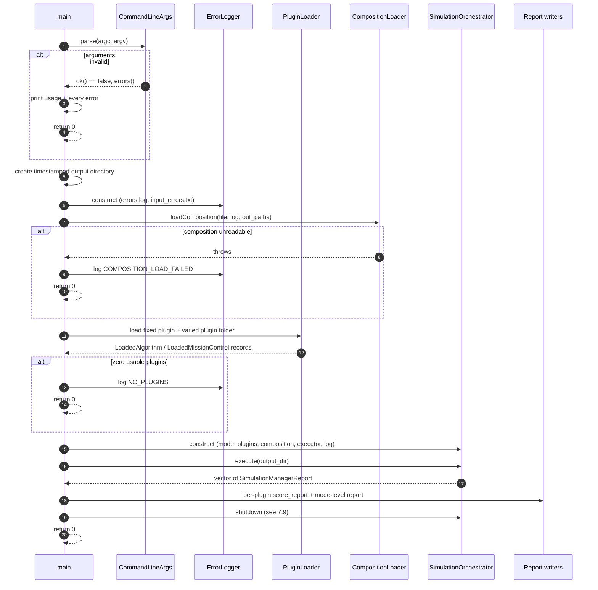

**Why this shape.** Every branch ends in `return 0` from `main`. Nothing calls `exit()`, nothing rethrows past
`main`. The output directory is created *before* the logger so the logger has somewhere to write; the logger is
created *before* the composition loader because the loader logs recoveries.

### 7.2 Plugin loading and registration

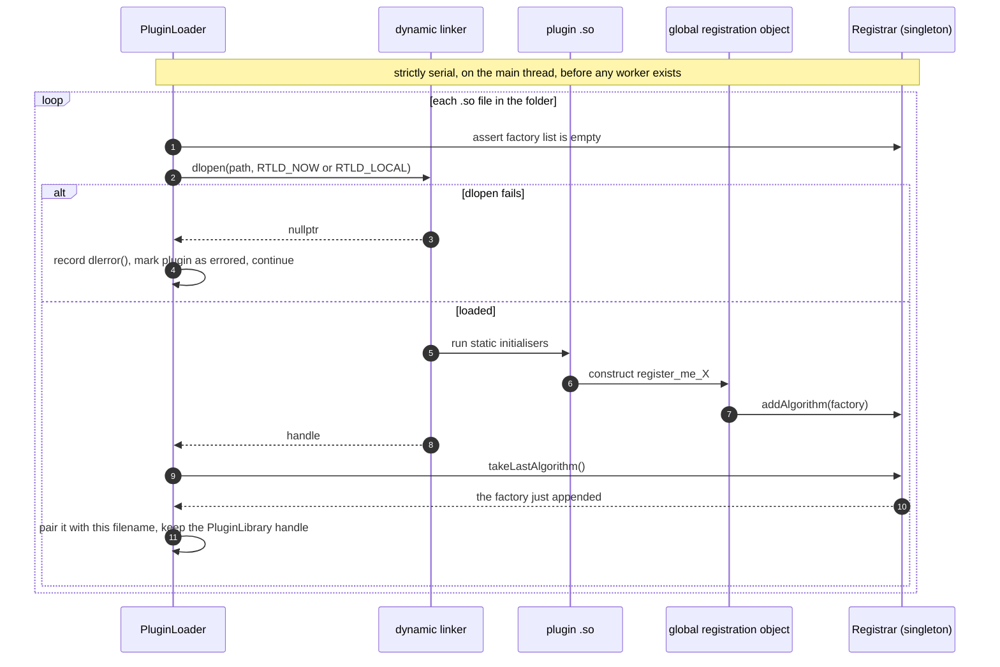

**Why load-then-claim.** The registration constructor receives *only* a factory — it cannot know which file it
came from. The association must therefore be inferred, and the only reliable inference is temporal: the list was
empty, exactly one `dlopen` happened, exactly one factory appeared. **That inference is valid only under
serialization**, which is why loading is done up front on the main thread. The payoff is that the entire
registration path needs no synchronisation at all.

`RTLD_NOW` is chosen over lazy binding so an unresolved symbol surfaces at load time — a broken plugin then
lands in the report's `errors:` list instead of aborting the process mid-run. `RTLD_LOCAL` keeps each plugin's
globals out of the global symbol namespace, which is what lets two teams' plugins with identical class names
coexist, and is why the lowercase-namespace decision is safe.

### 7.3 Task table construction and dispatch

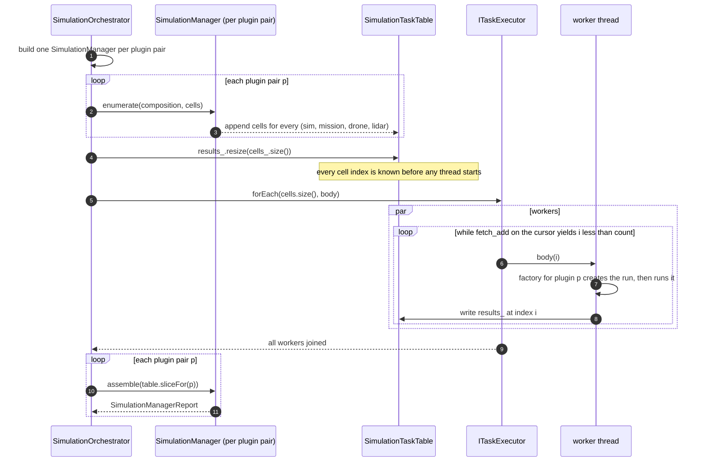

**Why one flat table across all plugins rather than one pool per plugin.** Enumerating per plugin and running
each plugin's set through the pool separately would insert a barrier between plugins; the tail of each plugin's
work would leave threads idle. Flattening removes every barrier and keeps the pool saturated until the very end.

**Why `results_[i] = ...` needs no lock.** Cell *i* is written by exactly one task and read by nobody until all
workers have joined. Distinct `std::vector` elements are distinct objects, so concurrent writes to different
indices do not race. The vector is sized before dispatch and never resized, so no iterator or reference is
invalidated.

**Why this also gives determinism.** Results land in index order regardless of completion order, so the
assembled report is identical at any thread count — the precondition for comparative grouping to mean anything.

### 7.4 One plugin pair over the whole composition (`ISimulation::run`)

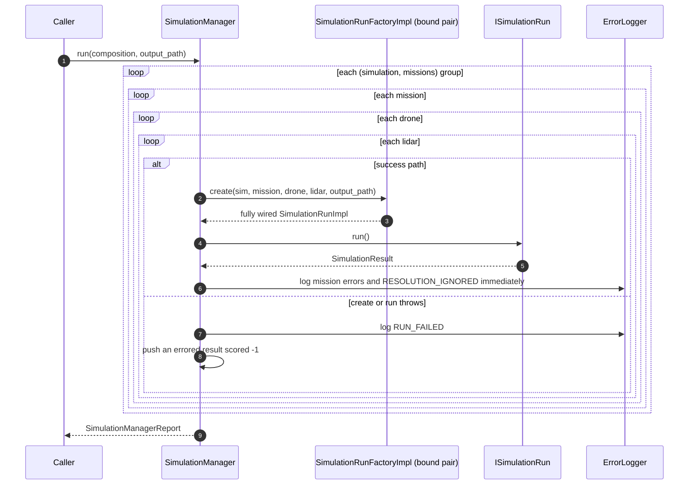

This is the interface-compliant path: it is what a standalone caller (or a unit test) gets, and it is exactly
what the orchestrator does in single-threaded mode. In multi-threaded mode the orchestrator performs the same
three steps — enumerate, execute, assemble — at a wider scope, so the semantics are identical and only the
scheduling differs.

### 7.5 Wiring one run (the factory)

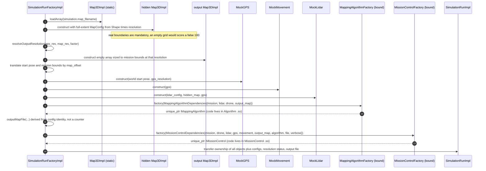

**Why the factory is still the single wiring seam.** It is the only place that knows concrete types, and it
stays that way in Ex3 — the difference is that two of the "concrete types" are now opaque, produced by
`std::function`s that were handed to us by libraries loaded at runtime.

**Why the output filename must be derived, not counted.** Ex2 used a `run_index_++` member on the factory. Under
concurrency that is both a data race and a source of nondeterminism: the same run would get a different filename
depending on scheduling, breaking goal 4. Ex3 derives the name from the identity of the four configs plus the
plugin label — `<plugin>__<simulation>__<mission>__<drone>__<lidar>.npy`. Since `create()` receives `const&`s
to configs that live inside the long-lived `SimulationCompositionData`, the factory resolves each one to its
index by **address comparison** against a precomputed identity index. That is read-only, lock-free, and stable.

**Why the dependency structs are safe.** Both hold *references*. Everything they reference is owned by
`SimulationRunImpl` (the maps, the mocks, the algorithm) or by the composition (the configs), and both outlive
the run. The factory never passes a temporary.

### 7.6 The mission loop (inside the MissionControl `.so`)

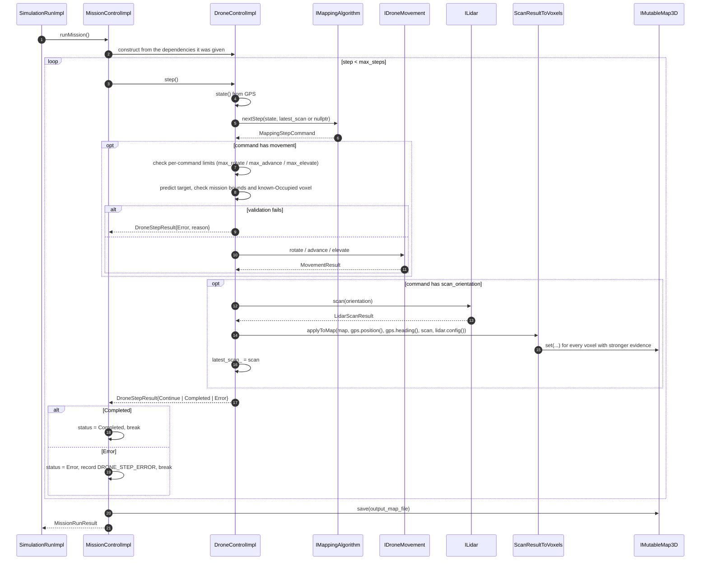

**The two ordering rules, restated because they are the easiest thing to get wrong.**

1. **The first step passes `nullptr`** for `latest_scan`. No scan exists yet, and the algorithm's first act is
   necessarily to scan in place.
2. **When a command carries both movement and a scan, movement is validated and executed first**, and the scan
   is taken from the *updated* pose. `MockLidar` reads the same `IGPS` internally, so scanning before moving
   would sample from a pose the lidar no longer believes in.

**Why `MissionControlImpl` constructs its own `DroneControlImpl`.** `MissionControlDependencies` deliberately
hands over raw sensors rather than a ready-made drone controller (the header comment says so outright). Drone
stepping is *mission policy* — how aggressively to validate, whether to retry, how to sequence movement and
scanning. Another team's MissionControl may make entirely different choices there, and the simulator must not
constrain them.

**Where collision safety actually lives.** `DroneControlImpl` can only reject moves into voxels *already known*
to be `Occupied` in the output map — it has no hidden map. Real safety comes from `MappingAlgorithmImpl` only
ever routing through cells it has observed to be `Empty`. This is a genuine invariant split across the two
plugins, and it is worth stating loudly because it looks like a gap otherwise.

### 7.7 Scan to voxels

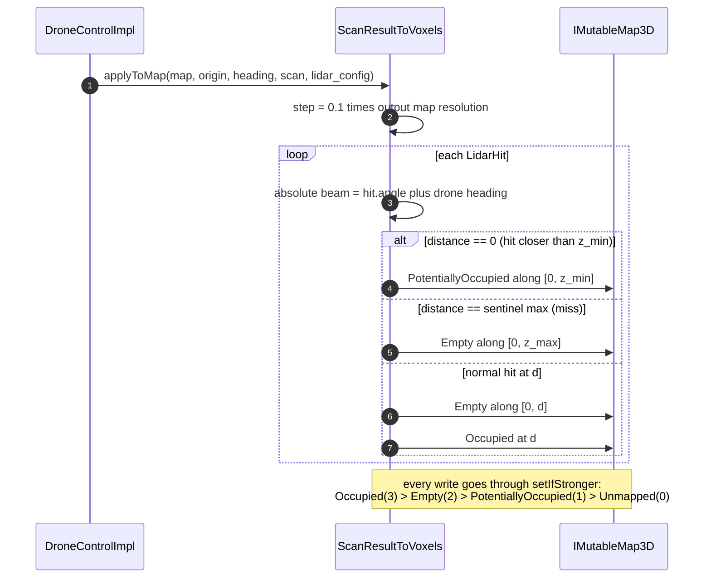

**Why the priority merge.** A voxel is observed many times from many poses. Without ranking, a later grazing
`Empty` sample would erase an earlier measured `Occupied` hit and the map would dissolve. Ranking makes the map
monotonic in evidence strength: measured occupancy is never downgraded by inference.

**Why the sub-voxel step.** Marching in `0.1 × resolution` increments matches `MockLidar`'s own tracing step, so
a diagonal ray cannot skip a thin voxel that the lidar itself detected.

### 7.8 Scoring and result assembly

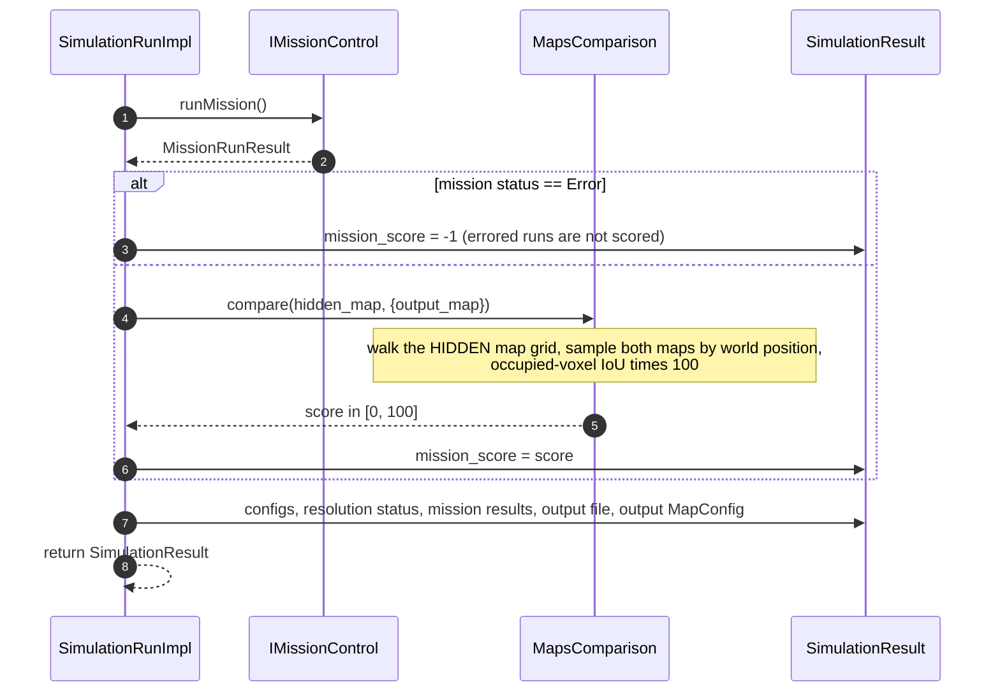

**Why scoring is simulator-side and sampled by world position.** The hidden map never crosses the `.so`
boundary, so only the simulator *can* score. Sampling by world position (rather than by matching voxel indices)
means an output map at a different resolution or offset is still scored correctly — the same property that made
Ex2's differing-resolution bonus work.

**Why empty–empty agreement is excluded from the IoU.** Most of a voxel world is empty. Counting empty
agreement would push every score toward 100 and destroy the metric's ability to rank algorithms — which is
exactly what competitive mode needs it to do.

### 7.9 Teardown

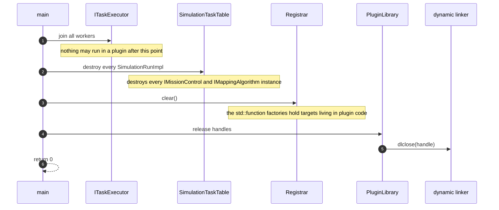

**Why this order is not negotiable.** "Objects related to the `.so`" is broader than it first appears. It
includes the plugin *instances*, obviously — but it also includes the **`std::function` factories themselves**,
whose callable targets are objects compiled into the plugin's code segment. `dlclose` while a factory is still
alive unmaps the code that its destructor is about to run.

**Why it is stated as an explicit sequence rather than left to destructors.** Destruction order within a scope
is reverse declaration order, which couples correctness to the order in which variables happen to be written.
That is far too fragile for a use-after-unmap bug, which typically manifests as a segfault in the C runtime with
no useful stack. `main` therefore performs the four steps as an explicit, commented sequence: the plugin
load report and the orchestrator both die in a nested scope, then `Registrar::clear()`, then
`releaseAll()`. It lives in `main` rather than in an orchestrator `shutdown()` because the loader
outlives the orchestrator by design - nesting the loader inside the object whose destruction must
precede `dlclose` would invert the very ordering this section exists to protect.

### 7.10 Mode-level report writing

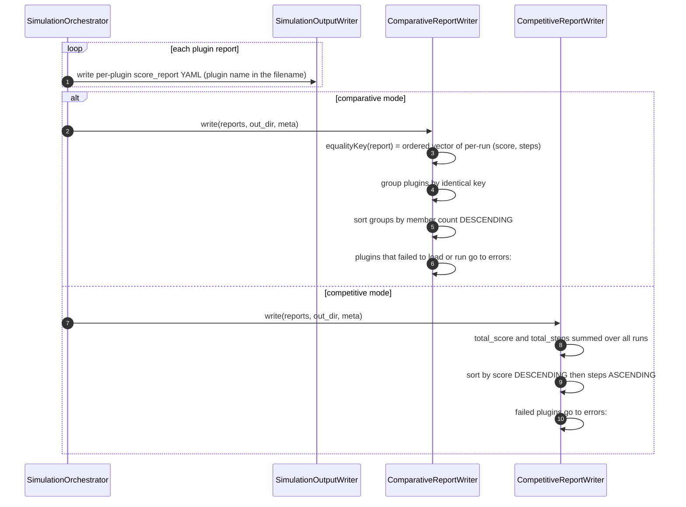

**Why grouping cannot be by total score.** The assignment's own sample shows `total_score: 495` appearing in
**two different groups**. Equality is behavioural: two mission controls agree only if they match *run by run*
across the whole composition. The chosen key is the ordered vector of per-run `(score, steps)` — cheap, exact
about observable behaviour, and stable because of the determinism guarantee from §7.3. If it proves too coarse
(two genuinely different maps producing identical scores and step counts on every run), the refinement is to
append a digest of each output map to the key.

---

## 8. Concurrency design

### 8.1 The thread rule

| `num_threads` | Threads spawned | Who works | Total live threads |
|---|---|---|---|
| absent | 0 | main | 1 |
| `1` | 0 | main | 1 |
| `N ≥ 2`, `task_count ≥ 2` | `min(N, task_count)` | workers; main blocks in `join()` | `1 + min(N, task_count)` |
| `N ≥ 2`, `task_count ≤ 1` | 0 | main | 1 |

The total is therefore **never exactly 2**. This reads like a typo in the assignment but is not: `N` counts
*additional* threads. Implementing "N including main" is a spec violation that is easy to ship by accident, so
the executor asserts the invariant in a unit test.

**The last row is where the assignment's two capping rules collide**, and it is the one case the spec does not
resolve. "Cap at `min(N, task_count)`" and "the total is never exactly 2" disagree at exactly one task: the cap
alone yields one worker plus a blocked main, which is the forbidden total. Falling back to the calling thread
satisfies both and wastes nothing — a lone worker while main sits in `join()` does no more work than main would
have done itself. The invariant that falls out, and the one the tests assert, is that **the worker count is
never exactly 1**.

The whole rule is therefore one predicate, `ThreadPoolExecutor::workerCountFor(task_count)`, so it can be
unit-tested as a table rather than inferred from behaviour. `main` never branches on `num_threads` at all.

### 8.2 Why an atomic cursor and not a queue

The work set is **fully known before execution begins**. A concurrent queue exists to handle work that arrives
dynamically; here nothing arrives. Using one would add a mutex, a condition variable, and a wake-up protocol to
solve a problem the system does not have.

```cpp
void ThreadPoolExecutor::drain(std::size_t count, const std::function<void(std::size_t)>& body) {
    for (std::size_t i = cursor_.fetch_add(1, std::memory_order_relaxed); i < count;
         i = cursor_.fetch_add(1, std::memory_order_relaxed)) {
        body(i);
    }
}

void ThreadPoolExecutor::forEach(std::size_t count, const std::function<void(std::size_t)>& body) {
    cursor_.store(0, std::memory_order_relaxed);

    const std::size_t workers = workerCountFor(count);
    if (workers == 0) { drain(count, body); return; }        // main does the work

    std::vector<std::thread> pool;
    pool.reserve(workers);
    try {
        for (std::size_t i = 0; i < workers; ++i) {
            pool.emplace_back([this, count, &body] { drain(count, body); });
        }
    } catch (const std::system_error&) { /* fewer workers than hoped; the drain below finishes it */ }

    for (std::thread& worker : pool) { worker.join(); }
    drain(count, body);                                       // no-op unless spawning failed
}
```

`memory_order_relaxed` is sufficient for the counter because it only distributes indices; the happens-before
edge that publishes each task's writes to the main thread is the `join()` itself.

The pool is spawned inside `forEach` rather than at construction because the cap needs `task_count`, which is
not known until the table has been enumerated — and the executor is constructed before that. There is exactly
one `forEach` per program run, so nothing is spawned repeatedly.

The trailing `drain` is the spawn-failure path. `std::thread`'s constructor throws when the system is out of
resources; if that happens partway through, the workers that did start still drain the table and anything left
over completes on the calling thread. A resource-starved machine degrades to fewer threads rather than
producing a short report. In the normal case the cursor is already past the end and the call returns at once.

Self-scheduling also load-balances for free, which matters here: run durations vary by orders of magnitude
(a 20³ map versus a 30³ map, an algorithm that finishes early versus one that exhausts `max_steps`). A static
range partition would leave threads idle; fetch-and-increment does not.

### 8.3 The complete inventory of shared mutable state

| State | Sharing | Protection |
|---|---|---|
| `SimulationTaskTable::results_` | one writer per index, no concurrent readers | none needed — disjoint elements, vector never resized |
| `SimulationTaskTable::cells_` | read-only during execution | none needed |
| The composition and its configs | read-only during execution | none needed |
| Plugin factories in the `Registrar` | read-only after loading; invoked concurrently | none needed — `std::function::operator()` on a `const` target is thread-safe if the target is |
| `ErrorLogger` | many writers | `std::mutex`, held only around the write |
| `std::cout` diagnostics | many writers | the same mutex |

Everything else is per-run and reachable from exactly one `SimulationRunImpl`: the two maps, the three mocks,
the algorithm instance, the mission control instance. **This is the deep reason the "never cache plugin
instances" rule is good architecture and not just a constraint** — creating fresh instances per run is what
makes every cell independent, and therefore what makes the lock-free design possible.

---

## 9. Ownership, lifetime, and teardown

```
main
 └── PluginLoader ────────── owns vector<PluginLibrary>          (dlopen handles)
 └── Registrar (singleton) ─ owns vector<factory>                 (targets live in plugin code)
 └── SimulationCompositionData                                    (all configs, referenced by cells)
 └── InlineExecutor / ThreadPoolExecutor                          (outlives the orchestrator)
 └── SimulationOrchestrator
      ├── vector<PluginRun>                                       (one per plugin pair)
      │    └── unique_ptr<SimulationManager>
      │         └── unique_ptr<ISimulationRunFactory>             (bound to that pair's factories)
      └── (during execute) SimulationTaskTable
             { vector<RunCell>, vector<SimulationResult>, plugin_ranges }

per task (transient, lives only inside one worker's iteration)
 └── unique_ptr<SimulationRunImpl>
      ├── unique_ptr<const IMap3D>        hidden map
      ├── unique_ptr<IMutableMap3D>       output map
      ├── unique_ptr<IGPS>                MockGPS
      ├── unique_ptr<IDroneMovement>      MockMovement
      ├── unique_ptr<ILidar>              MockLidar
      ├── unique_ptr<IMappingAlgorithm>   ← from the Algorithm .so
      └── unique_ptr<IMissionControl>     ← from the MissionControl .so
           └── unique_ptr<IDroneControl>  (created inside the .so)
```

Three ownerships sit deliberately *outside* the orchestrator, and each is a lifetime statement rather than a
style preference:

- **The `PluginLoader` stays in `main`.** It holds the `dlopen` handles, so it must outlive everything that
  holds plugin-derived callables — including the orchestrator. Nesting it inside would invert exactly the
  ordering the teardown depends on.
- **The executor is injected by reference, not owned.** Constructing it from `num_threads` inside the
  orchestrator would fuse the threading policy to the class that has no other reason to know about threads;
  as a parameter, a test substitutes a deliberately out-of-order executor and phase 08 substitutes a pool,
  neither touching the orchestrator.
- **The task table is local to `execute()`.** It is dead the moment the reports are assembled, and keeping
  48 results alive for the orchestrator's whole life buys nothing. Its cells hold raw factory pointers into
  the managers, so it must not outlive them — being a local inside the method that owns them makes that
  automatic instead of merely true.

The rule carried over from Ex2 and still holding: **`SimulationRunImpl` owns everything for its run via
`unique_ptr`; every inner component holds non-owning references to its siblings.** Component lifetime is
exactly the run's lifetime, which is exactly one task's iteration.

The one lifetime that crosses the `.so` boundary is the plugin instance, and it is destroyed inside the same
`SimulationRunImpl` destructor that created it — long before any `dlclose`. Ordering within the destructor
matters too: `mission_control_` must be destroyed before the algorithm and the mocks it references, so members
are declared in construction order and destroyed in reverse.

**`shared_ptr` appears nowhere.** It briefly did — `Map3DImpl` held `shared_ptr<NpyArray>` on the stated
grounds that the array was "shared between the map wrapper and the loader that produced it". That was simply
untrue: `loadArray` and `makeEmptyArray` each produce an array that is moved into exactly one `Map3DImpl`, and
no two maps ever reference the same array. The loader hands over and lets go. Phase 09a converted it to
`unique_ptr`, so ownership is `unique_ptr` throughout, with no `new` and no `delete` anywhere.

The general lesson is worth keeping: a `shared_ptr` whose justification is a *sentence* rather than a second
owner you can name is almost always a `unique_ptr`.

---

## 10. Error containment

Failure is contained at the narrowest scope that still leaves the system meaningful:

| Scope | Failure | Response | Where |
|---|---|---|---|
| Argument | unsupported / missing / unopenable / empty folder | print usage + **every** error, return from `main` | `CommandLineArgs` |
| Config field | missing or invalid key | default + `CONFIG_MISSING_KEY` / `CONFIG_BAD_VALUE`, keep parsing | `CompositionLoader` |
| Referenced config file | unreadable, or missing its wrapper key | undefined node → all defaults + `CONFIG_REF_*`, keep parsing | `CompositionLoader` |
| Composition file | unreadable | log `COMPOSITION_LOAD_FAILED`, return from `main` | `main` |
| One plugin | `dlopen` fails or no factory registered | plugin named in the report's `errors:`, every run it owned scores -1 | `PluginLoader`, report writers |
| One run | bad map file, wiring throw | `RUN_FAILED`, score -1, **next cell** | `SimulationManager` / task body |
| One mission | illegal move, collision | `DRONE_STEP_ERROR`, mission ends, score -1, next cell | `MissionControlImpl` |
| Anything else | escapes a task body | caught at the task boundary, logged `FATAL`, cell scored -1 | task body |

Two rules make this work in a threaded program:

- **Every task body is wrapped in `try`/`catch(...)`.** An exception escaping a worker thread terminates the
  process — `std::terminate`, no unwinding, no report. That would violate goal 1 outright, so the catch is at
  the task boundary, not further out.
- **Errors are logged the moment they occur**, not collected and flushed at the end. The `ErrorLogger` flushes
  per line so a later hard failure cannot swallow earlier diagnostics.

The simulator is **not** required to survive a crash *inside* a plugin (a segfault in third-party code cannot be
contained in-process). It is required to survive everything else.

---

## 11. Design decisions and rationale

This section records the reasoning behind each non-obvious choice, so a future change can tell whether it is
breaking something load-bearing.

### 11.1 The factory is bound to a plugin pair at construction

**Alternatives:** add a parameter to `create()` (violates the frozen signature); a mutable "current plugin"
global read by the factory (unusable concurrently, and invisible coupling).

**Why the chosen one wins:** constructors are ours to define, so it costs nothing in compliance. More
importantly it turns each `ISimulation::run` into a pure function of `(composition, plugin pair)` with no shared
mutable state — the property that makes the concurrency safe *by construction* rather than by locking. It also
means the plugin identity is available inside the factory, which is what allows deterministic output-file naming.

### 11.2 An orchestration layer above `ISimulation`

`ISimulation::run` has no room for a mode, a plugin set, a thread budget, or a cross-plugin report. Rather than
distort the interface's meaning, everything Ex3-specific lives above it. The interface keeps its Ex2 semantics
exactly — *"run this composition and report"* — and remains independently usable and testable.

### 11.3 A dense pre-computed table instead of a work queue

Covered in §8.2. The short version: the work set is static, so the dynamic machinery of a queue buys nothing and
costs a mutex plus a condition variable. The static table additionally buys **determinism**, which comparative
mode requires.

### 11.4 All plugins loaded up front, serially, on the main thread

The assignment explicitly endorses it, and the load-then-claim association is *only valid* under serialization.
Loading lazily inside workers would require locking the registrar, locking a "have I loaded this yet" map, and
would still leave the claim ambiguous if two threads loaded simultaneously. The cost — holding a few `.so`s open
that a run might not need — is trivial. (A load-once/unload-when-idle scheme is offered as a bonus; it is
strictly harder and is not the default plan.)

### 11.5 `Registrar` is a singleton

**Forced, not chosen.** The frozen registration constructor takes only a factory:

```cpp
struct MappingAlgorithmRegistration { explicit MappingAlgorithmRegistration(MappingAlgorithmFactory); };
```

It runs during static initialisation of a library the host just opened. There is no `this`, no context
parameter, no way to pass a destination. The destination must therefore be reachable from a free function —
i.e. a global. Meyers-singleton form (function-local `static`) gives thread-safe initialisation, though in
practice all access is serialized anyway.

### 11.6 `DroneControl` inside the MissionControl plugin

Mandated in effect by `MissionControlDependencies` (raw sensors plus the comment *"mission will create its own
drone controller"*), and correct on the merits: how a mission drives a drone is mission policy. A different
team's MissionControl might validate differently, retry differently, or batch scans differently. Keeping
`IDroneControl` in `common_mission_control/` rather than `common/` states that boundary in the file layout.

The consequence is that **`ScanResultToVoxels` moves with it** — writing scan results into the map is part of
stepping the drone, and it is no longer provided in `common/`.

### 11.7 MissionControl does not receive the hidden map

Ex2 passed it. Ex3 must not: a plugin from another team would otherwise be able to read ground truth and write
a perfect map without flying. The hidden map is reachable only from `MockLidar` (which exposes it solely as beam
distances) and `MapsComparison` (which runs after the mission ends). This is the single most important isolation
property in the design, and it is enforced by the shape of `MissionControlDependencies`.

### 11.8 Output filenames derived from config identity, not a counter

Ex2's `run_index_++` is both a data race and a determinism hazard under threading. Deriving the name from
`<plugin>__<simulation>__<mission>__<drone>__<lidar>` makes it stable, self-documenting (the assignment asks
that the owning run be obvious from the filename), and lock-free. Index resolution is by address comparison
against the composition's own storage, which is read-only during execution.

### 11.9 `RTLD_LOCAL` rather than `RTLD_GLOBAL`

Two teams' plugins may define identically named symbols. `RTLD_LOCAL` keeps each plugin's globals out of the
global namespace so they cannot collide or interpose on one another. This is also what makes the project's
lowercase-namespace decision safe despite the PDF's ID-suffixed-namespace suggestion — the isolation the PDF was
reaching for is achieved by the loader flag instead, with the ID suffix retained on filenames and on the
registration alias.

### 11.10 Equality by the ordered `(score, steps)` vector

The assignment's sample output proves equality is not score equality (`495` appears in two groups). The
observable behaviour of a mission control across a fixed composition is exactly its per-run scores and step
counts, in order. This is cheap to compute, needs no extra storage, and is exact with respect to what the report
actually reports. The known limitation — two different maps could coincidentally produce identical scores and
step counts on every single run — is remote, and the refinement (append a per-map digest) is a localized change
to one function.

### 11.11 Ported logic is rewritten, not copied

Ex2 lives in one `drone_mapper` namespace and one static library. Every Ex3 file is written fresh against the
Ex3 namespaces, the three-project split, and the `.so` boundary. What carries over is the *understanding*: ray
marching, scan-to-voxel conversion with priority merging, world↔voxel index mapping, the composition YAML layout
and its path-resolution rule, IoU scoring, the step loop and its ordering invariants, and the frontier-BFS
exploration strategy.

---

## 12. Open decisions

| # | Decision | Current lean | Resolve by |
|---|---|---|---|
| 1 | `same_results` equality key | ordered `(score, steps)` vector; map digest as a refinement | when `ComparativeReportWriter` is written |
| 2 | Does `UserCommon/` get created, and with what? | only if real duplication appears; the likely content is the world↔voxel geometry shared by `MockLidar` and `ScanResultToVoxels` | when the second consumer of that geometry is written |
| 3 | Testing scope | assume Ex2's component + integration expectations still hold; wire per-subproject gtest targets | early — test wiring shapes the CMake layout |
| 4 | Load-once / unload-when-idle bonus | not the default plan | only after the mainline works |

When any of these is resolved, update both this document and `project_context.md` §8.

---

## 13. Constraint traceability

Where each hard constraint from `project_context.md` §9 is discharged in this design:

| Constraint | Discharged by |
|---|---|
| No `new` / `delete` | §9 — `unique_ptr` throughout; no `shared_ptr` anywhere |
| Never modify `common/` | §3 — all Ex3 concepts live in new Simulator-side classes |
| Never change a provided signature | §4 — the plugin dimension is closed by constructor binding |
| `drone_warnings` on every target | build wiring, phase 00 |
| Never crashes, never `exit()` | §7.1, §10 — every branch returns from `main`; every task body catches |
| Errors logged immediately | §10 — `ErrorLogger` flushes per line, under a mutex |
| `dlclose` only after all plugin objects **and** factories are gone | §7.9 — explicit four-step sequence in `main` |
| No cached plugin instances, never reload a `.so` | §8.3 — fresh instances per run are what make cells independent |
| mp-units types throughout | carried over; unit stripping only via the deliberate `force_numerical_value_in` idiom |
| Thread count 1, or 1 + N (N ≥ 2), never 2, never idle | §8.1 — asserted in a unit test |
| Algorithm never flies into walls | §7.6 — the observed-`Empty`-only traversal invariant |
